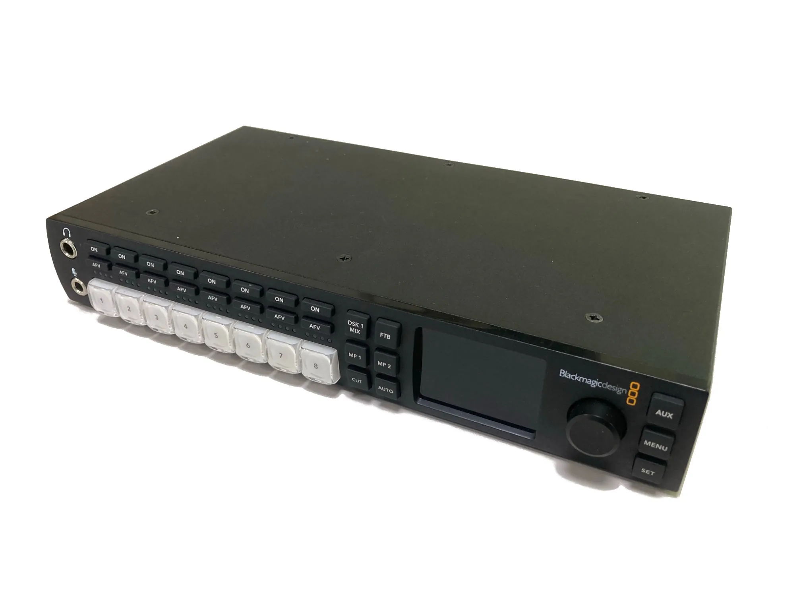

# ATEM マニュアル

ステージのスクリーンには、カメラ映像や動画を映します。
それら映像をスムーズに切り替えるために、映像スイッチャは必要不可欠です。

ATEM は、Blackmagic Design 社によって製作されている業務用放送機器のシリーズです。
そのうちの 1つ、ATEM Television Studio HD は、コンパクトながら小規模なイベントや配信に十分な機能を持った機器です。

プロ仕様とあって、操作方法も少しクセがあり、思い通り扱うには少し慣れが必要でしょう。

このコースでは、セットアップや映像入出力構造、基本操作を主に説明します。
より高度な演出をするための機能も合わせて説明しています。
