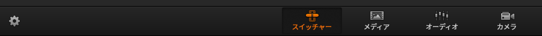

# 静止画を使う

開演前や休憩時間中などに、用意した静止画を映したいことがあるかもしれません。
しかし、その映像を出すためにわざわざ PC など映像出力機器を用意するのは少々手間です。

そこで、ATEM スイッチャ内蔵の静止画メモリと Media Players を使う手があります。

## 静止画を登録する

このような静止画を使用したいとします。

まずは ATEM Software Control 画面下の 'メディア' を開きます。

20枚の静止画スロットが開きます。
ここで現在登録している静止画を確認したり、変更したりできます。

画面左のローカルライブラリから画像ファイルを選択、または画像ファイルをドラッグ&ドロップでスロットに画像をセットすることができます。

これで ATEM 内蔵メモリに静止画を登録できました。

## 静止画を送出する

静止画は 20枚まで登録できますが、同時に送出できるのはそのうち 2枚だけです。

まずは 'スイッチャー' 画面に戻ります。

右側の 'Media Players' メニューで、Media Player1 / 2 それぞれで 20枚中どの静止画を送出するかを選択します。

ATEM Software Control のプレビュー中の 'MP1' 'MP2' ボタンで、プレビューに静止画を送出。

本体ボタンでは 'MP1' 'MP2' で選択できます。

あとは Program と切り替えるだけです。
これで、HDMI や SDI の映像入力のように、静止画を送出できました。

?> テロップなどが描かれた静止画を他映像に合成し、より高度な演出をするには[映像を合成する](./video-composite.md)を参照
