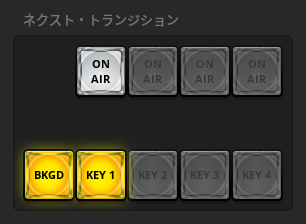
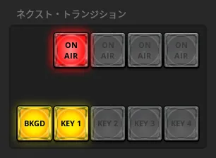

# 映像を合成する

## ATEM の映像合成フロー

[主な端子と映像入出力フロー](./video-terms-and-io.md)のページでは、最も基礎的な入力 (ソース) 選択を扱いました。
実は、その先にはいくつかのレイヤーがあり、それらが合わさった映像が最終的に Preview/Program として出力されます。

特に Upstream Key では、高度な映像合成をすることが可能です。

?> ATEM の機種によっては、さらに多くのレイヤーが備わっています。

## Upstream Key

ATEM Software Control スイッチャ画面の右側から、Upstream Key の設定ができます。

Preview/Program へ適用するには、ネクスト・トランジションを操作します。

?> 機種によって Upstream Key の個数は異なり、それによって KEY 2~4 が利用可能になります。

### クロマキー合成

クロマキー合成は、クロマ (chroma: 彩度) から判定して映像の一部を切り抜き、合成する手法です。
除去する色によってブルーバック合成、グリーンバック合成とも呼ばれます。

[静止画を使う](./use-still.md)のページの手順で、ブルーバックの映像入力がされているとして、それを合成したいとします。

フィルソースで合成したい (上に重ねたい) 映像を選択します。
Media Player 1 からブルーバック映像を送出しているので、それを選びます。

色相で除きたい色 (透明にしたい色) を選択します。
青が消えるように、青 (260°) を選びます。

これで基本設定は完了です。

?> 合成の適用手順は次の項で説明します。

!> 設定が悪かったせいか、例では青が抜けきれておらず少し紫がかっています。設定またはブルーバック素材の調整が必要になります。

追加でフライキーを変更すると、合成の位置やサイズを変更できます。

?> 設定タブ 'クロマ' の左にあった 'ルマ' では、ルマキー合成を設定できます。これはルマ (luma, luminance: 輝度) から判定して映像を切り抜く手法です。ATEM では輝度の低い (黒い) 部分が抜けて合成されます。

### Upstream Key の適用

上のクロマキー合成を適用してみます。

?> 以降のパターン合成、ピクチャー・イン・ピクチャー (DVE) も同様の手順で適用できます。

KEY 1 を有効化すると、Preview に Upstream Key が適用されます。

この状態でスイッチすれば、Program に反映されます。

### パターン合成

他の合成手法を紹介します。

パターン合成は、指定の形に映像を切り抜いて合成する機能です。

サイズなどのパラメータを設定すると、切り抜き図形のサイズなどを調整できます。

クロマキー合成で説明したフライキーは、パターン合成にも適用できます。

### ピクチャー・イン・ピクチャー (DVE)

DVE (Digital Video Effect) は、映像の拡大や縮小などを行うシステムを意味します。(参照元: <https://kotobank.jp/word/DVE-573827>)

いわゆるピクチャー・イン・ピクチャーで、バラエティー番組などで見かけるワイプを実現するのに使えます。

追加でシャドウやボーダーを設定すると、合成映像の枠に影をつけたり線をつけたりできます。

## Downstream Key

単純な映像合成なら Downstream Key を活用する手があります。

トランジションよりも下流で合成するため、Upstream Key と違い Preview/Program の切り替えの影響を受けません。
そのため、例えば常時表示するテロップの合成に向きます。

基本操作は表示/非表示 (ON AIR ボタン) のみでシンプルです。
AUTO ボタンでは、表示/非表示を緩やかに切り替えられます。(トランジションの MIX 相当)

合成手法はリニアキーが採用されています。
これは、合成する映像入力 (フィルソース)、合成映像のうち除きたい (透明にする) 部分を示す映像入力 (キーソース) の 2つから合成をします。

図とともに詳しく解説されているブログがありましたので、詳細はそちらに委ねます。

<https://note.com/tkykmts/n/n3a16af5dbf3f>

## Fade to Black

Program の出力を完全に黒画面へ切り替えます。
最も下流のレイヤーなので、Upstream Key も Downstream Key も含めて完全に黒画面へ変えます。

?> Preview/Program で黒画面を選択するだけでは、Upstream Key や Downstream Key の合成が残ってしまいます。

普段は使いませんが、映像録画などで緩やかに映像を切りたいときに使えます。
