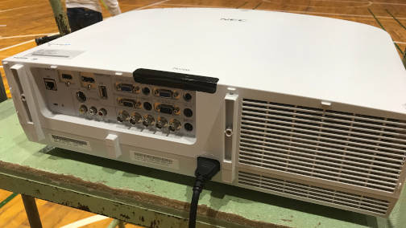

# プロジェクタの電源について

プロジェクタは、**基本的には指示があるまで電源コードを抜かないでください。**

## 理由

プロジェクタの電源オフ後、しばらくはファンが稼働し続け、冷却が行われます。
しかし、冷却が完了する前に電源コードを抜いてしまうと、高温な状態が続き、**寿命の低下**につながってしまいます。
ステージイベントにおいては、プロジェクタを長時間連続で稼働するため、十分な冷却が必要になります。

## 片付けにおける注意点

機材片付けの際、プロジェクタに繋がるドラムコードやテーブルタップの扱いには、十分注意してください。
電源コードの取り外しは、**ファンの停止を確認し、必ず映像機材の管理担当の確認をとった上で**行ってください。
