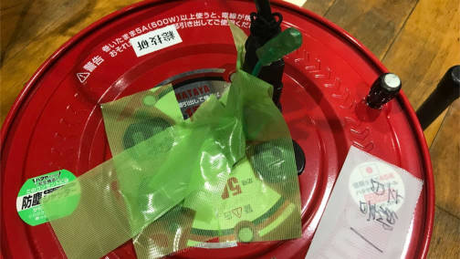

# 電源管理について

準備日なども含めた会場の使用期間中、基本的に**許可無くコンセントを使用することを禁止しております。**
これは、技研員だけでなく、他部署のスタッフ、来場者含めた全員にお願いをしております。

会場のコンセントは、テープによって閉じられています。
イベント終了まで、勝手にテープを剥がして機器を繋ぐことが無いよう、お願い致します。

ご不便をおかけしますが、もちろん正当な理由があっての上でお願いです。

## コンセントが使えない理由

一般家庭用コンセントは、各系統ごとに 1500W まで出力することができます。
一方で、技研では 1000W クラスの機材を使用することがあります。
機器の電源接続を誤ってしまうと、許容を超えた負荷をかけ、**最悪の場合ブレーカーを落とす事態へ**とつながってしまいます。

こうした事態を避けるため、総技研では電源接続機器の管理を徹底しております。
以上の理由により、許可無くコンセントに機器を接続しないよう、お願いをしております。

## コンセントを利用したい場合

利用を希望する場合、**必ず技研員までお声掛けください。**
繰り返しになりますが、許可無く利用することの無いよう、お願い致します。

電源の使用量に余裕がある場合、機材の電源を落としている場合などは、コンセントの利用を許可できることがあります。
